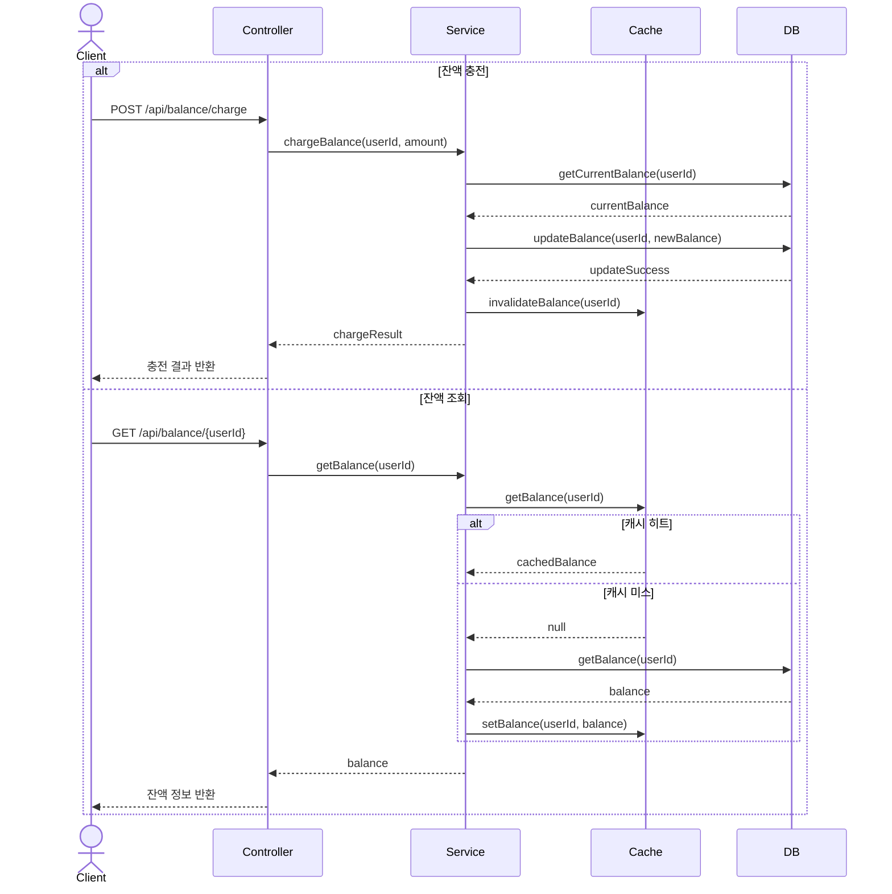

# Use-Case

```mermaid
sequenceDiagram
    actor Client
    participant Controller
    participant Service
    participant Cache
    participant DB

    alt 잔액 충전
        Client->>Controller: POST /api/balance/charge
        Controller->>Service: chargeBalance(userId, amount)
        Service->>DB: getCurrentBalance(userId)
        DB-->>Service: currentBalance
        Service->>DB: updateBalance(userId, newBalance)
        DB-->>Service: updateSuccess
        Service->>Cache: invalidateBalance(userId)
        Service-->>Controller: chargeResult
        Controller-->>Client: 충전 결과 반환

    else 잔액 조회
        Client->>Controller: GET /api/balance/{userId}
        Controller->>Service: getBalance(userId)
        Service->>Cache: getBalance(userId)
        alt 캐시 히트
            Cache-->>Service: cachedBalance
        else 캐시 미스
            Cache-->>Service: null
            Service->>DB: getBalance(userId)
            DB-->>Service: balance
            Service->>Cache: setBalance(userId, balance)
        end
        Service-->>Controller: balance
        Controller-->>Client: 잔액 정보 반환
    end
```