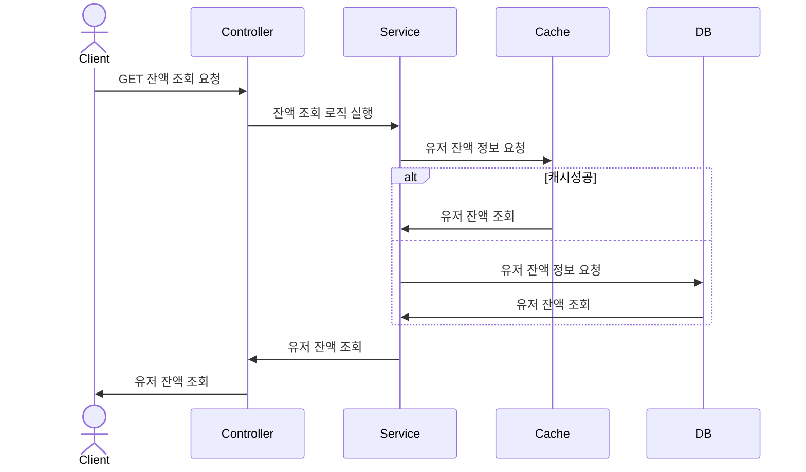

## 잔액 조회 시퀀스 다이어그램

```mermaid
sequenceDiagram

actor Client
participant Controller
participant Service
participant Cache
participant DB

Client->>Controller: GET 잔액 조회 요청
Controller->>Service: 잔액 조회 로직 실행
Service->>Cache: 유저 잔액 정보 요청
    alt 캐시성공
        Cache->>Service: 유저 잔액 조회
    else
        Service->>DB: 유저 잔액 정보 요청
        DB->>Service: 유저 잔액 조회
    end
Service->>Controller: 유저 잔액 조회
Controller->>Client: 유저 잔액 조회
```
