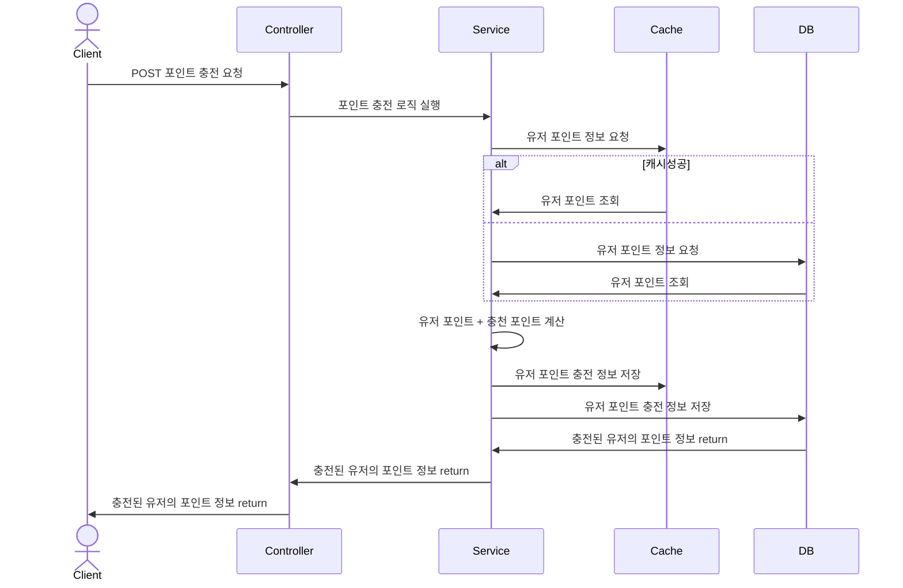

## 포인트 충전 시퀀스 다이어그램

```mermaid
sequenceDiagram

actor Client
participant Controller
participant Service
participant Cache
participant DB

Client->>Controller: POST 포인트 충전 요청
Controller->>Service: 포인트 충전 로직 실행
Service->>Cache: 유저 포인트 정보 요청
    alt 캐시성공
        Cache->>Service: 유저 포인트 조회
    else
        Service->>DB: 유저 포인트 정보 요청
        DB->>Service: 유저 포인트 조회
    end
Service->>Service: 유저 포인트 + 충천 포인트 계산
Service->>Cache: 유저 포인트 충전 정보 저장
Service->>DB: 유저 포인트 충전 정보 저장
DB->>Service: 충전된 유저의 포인트 정보 return
Service->>Controller: 충전된 유저의 포인트 정보 return
Controller->>Client: 충전된 유저의 포인트 정보 return
```